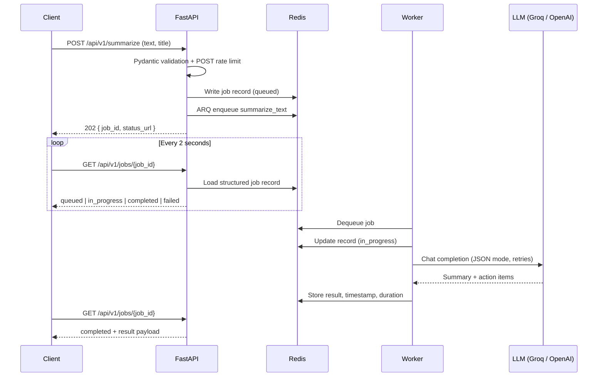

# FastAPI Async AI Worker

A production-style asynchronous AI pipeline. FastAPI accepts a "summarize and
extract action items" job and returns immediately; an ARQ worker picks the job
up from Redis, calls an LLM (Groq, OpenAI, or a built-in mock), and the client
polls for a structured JSON result.

## Live demo

| | Link |
|---|---|
| **Live app (dashboard)** | https://fastapi-ai-worker.onrender.com |
| **API docs (Swagger)** | https://fastapi-ai-worker.onrender.com/docs |
| **Health check** | https://fastapi-ai-worker.onrender.com/health |

> **Note:** this runs on free-tier hosting. After a period of inactivity the
> first request can take up to a minute while the service wakes up. The demo
> is rate limited to 10 submissions per minute.

### Try it from the command line

```bash
# 1. Submit a job (returns 202 right away)
curl -X POST https://fastapi-ai-worker.onrender.com/api/v1/summarize \
  -H "Content-Type: application/json" \
  -d '{"title": "Q3 planning", "text": "We agreed to launch the beta in October. Priya will own the onboarding flow and Sam will finish the billing integration before the end of the month."}'

# 2. Poll the status URL from the response
curl https://fastapi-ai-worker.onrender.com/api/v1/jobs/<job_id>
```

## How it works



| Component | Role |
| --- | --- |
| **API** (`app/main.py`) | FastAPI app: validation, rate limiting, enqueueing, status polling, serves the dashboard |
| **Worker** (`app/worker.py`) | ARQ process that runs `summarize_text` and records the outcome |
| **Redis** | Job queue, job-record store (24h TTL), and rate-limit counters |
| **AI client** (`app/ai_client.py`) | OpenAI-compatible async client with retries and a mock fallback |
| **Dashboard** (`static/`) | Single-page UI that submits text and polls every 2 seconds |

## Features

- **Non-blocking API**: submitting a job returns `202 Accepted` immediately;
  the slow LLM call never blocks a request.
- **Structured output**: the model is run in JSON mode and validated against
  Pydantic models (summary, key topics, action items with owner and priority).
- **Retries with backoff**: timeouts, connection errors and transient rate
  limits are retried up to 4 times with exponential backoff (1–16 s). Billing
  and quota errors are detected and not retried.
- **Multiple providers**: Groq (default), OpenAI, or a deterministic mock
  provider. With no API key configured, the worker uses the mock so the whole
  pipeline still runs. If a live provider reports insufficient quota, the job
  falls back to the mock instead of failing.
- **Rate limiting**: a Redis-backed middleware (included in this repo as
  `fastapi_async_ratelimit/`) limits POST requests per client IP, and fails
  open if Redis is unavailable.
- **Observable job records**: every state change is written to Redis with a
  UTC timestamp, execution duration and the provider that produced the result.
- **Graceful degradation**: if Redis is down at startup, the dashboard still
  loads and the API returns a clear `503` instead of crashing.
- **Backward-compatible endpoints**: legacy paths and the `prompt` field are
  still accepted.

## API reference

| Method | Path | Description |
| --- | --- | --- |
| `POST` | `/api/v1/summarize` | Enqueue a job. Rate limited. Returns `202` |
| `GET` | `/api/v1/jobs/{job_id}` | Job status: `queued`, `in_progress`, `completed` or `failed` |
| `GET` | `/health` | Liveness probe |
| `GET` | `/docs` | Interactive OpenAPI docs |
| `GET` | `/` | Demo dashboard |
| `POST` | `/api/v1/ai/generate` | Legacy alias for `/api/v1/summarize` |
| `GET` | `/api/v1/ai/tasks/{job_id}` | Legacy alias for `/api/v1/jobs/{job_id}` |

**Request body** (`POST /api/v1/summarize`):

| Field | Type | Rules |
| --- | --- | --- |
| `text` | string | Required, 20 to 20,000 characters |
| `title` | string | Optional, up to 200 characters |

**Accepted response** (`202`):

```json
{
  "job_id": "3f9c2e1a...",
  "status": "queued",
  "message": "Summarize job queued.",
  "status_url": "/api/v1/jobs/3f9c2e1a..."
}
```

Other responses: `422` for invalid input, `429` when rate limited, `503` when
Redis is unavailable, `404` for an unknown or expired job.

## Job record

The worker writes the Redis key `ai_job:{job_id}` on every state change
(expires after 24 hours):

```json
{
  "job_id": "3f9c2e1a...",
  "status": "completed",
  "result": {
    "summary": "…",
    "action_items": [{"description": "…", "owner": "Priya", "priority": "high"}],
    "key_topics": ["…"],
    "title": "Q3 planning"
  },
  "error": null,
  "timestamp": "2026-08-28T14:00:00+00:00",
  "execution_duration_seconds": 3.21,
  "provider": "groq"
}
```

## Local setup

1. **Start Redis** (Docker is enough):

```bash
   docker run -d --name redis -p 6379:6379 redis:7-alpine
```

2. **Create a virtual environment and install dependencies:**

```bash
   python -m venv venv
   source venv/bin/activate        # Windows: venv\Scripts\activate
   pip install -r requirements.txt
```

3. **Configure environment variables:**

```bash
   cp .env.example .env            # Windows: copy .env.example .env
```

   Set `OPENAI_API_KEY` (a Groq or OpenAI key, depending on `AI_PROVIDER`).
   With no key, the worker uses the mock provider.

4. **Run the API and the worker** in two terminals:

```bash
   uvicorn app.main:app --reload
   arq app.worker.WorkerSettings
```

5. Open http://127.0.0.1:8000, submit some text, and watch the status update.

## Configuration

All settings are read from environment variables (or `.env`).

| Variable | Default | Description |
| --- | --- | --- |
| `AI_PROVIDER` | `openai` (`groq` in `.env.example`) | `groq`, `openai` or `mock` |
| `OPENAI_API_KEY` | _empty_ | API key for the selected provider (used for Groq too). Empty means mock |
| `OPENAI_MODEL` | `gpt-4o-mini` | Model name. For Groq the default is `openai/gpt-oss-20b`; retired Groq models are remapped automatically |
| `REDIS_URL` | _empty_ | Full Redis URL (for example `rediss://...`). Takes priority over host/port |
| `REDIS_HOST` / `REDIS_PORT` / `REDIS_DB` | `localhost` / `6379` / `0` | Used when `REDIS_URL` is empty |
| `AI_TIMEOUT_SECONDS` | `45` | Per-request timeout for the LLM call |
| `AI_MAX_RETRIES` | `4` | Attempts for transient LLM errors |
| `RATE_LIMIT_REQUESTS` | `10` | Allowed POST requests per window, per IP |
| `RATE_LIMIT_WINDOW_SECONDS` | `60` | Rate limit window |
| `JOB_TTL_SECONDS` | `86400` | How long job records are kept |

Never commit your real `.env` file. It is listed in `.gitignore`.

## Docker

```bash
cp .env.example .env
docker compose up --build
```

Compose starts three services: `redis`, `api` (port 8000) and `worker`. The
dashboard is at http://localhost:8000. Inside the Compose network the app
reaches Redis at `redis:6379`.

## Deployment (Render)

The live demo runs on Render as a single Docker web service defined in
`render.yaml`. `start.sh` starts the ARQ worker in the background and then
runs Uvicorn in the foreground, so one free-tier service handles both the API
and the background jobs.

1. Create a **Key Value (Redis)** instance on Render in the same region as the
   web service, and copy its **Internal** connection URL.
2. Create a new **Blueprint** (or Web Service) from this repository.
3. Set the environment variables:
   - `REDIS_URL`: the Redis internal URL
   - `OPENAI_API_KEY`: your Groq or OpenAI key
   - `AI_PROVIDER` and `OPENAI_MODEL`: already set in `render.yaml`
4. Deploy, then check `https://<your-service>.onrender.com/health`.

Because the worker lives in the same container as the web server, jobs only
process while the service is awake. For heavier workloads, run the worker as
a separate Render Background Worker with the same environment variables.

## Project structure

```
app/
  main.py          FastAPI app, routes, lifespan, dashboard
  worker.py        ARQ worker function and settings
  ai_client.py     LLM client, retries, JSON parsing, mock provider
  schema.py        Pydantic request/response models
  job_store.py     Redis job-record persistence
  config.py        Environment-based settings
fastapi_async_ratelimit/
  middleware.py    Redis-backed rate-limiting middleware
static/            Demo dashboard (HTML, CSS, JS)
start.sh           Runs the worker and API in one container
Dockerfile
docker-compose.yml
render.yaml
```

## Design notes and limitations

- **Single try per job.** ARQ runs each job once (`max_tries = 1`), and retries
  happen inside the AI client. Failed jobs are recorded as `failed` with an
  error message instead of being re-queued.
- **Fixed-window rate limiting.** Counters are bucketed per window, so a client
  can briefly burst across a window boundary.
- **Polling, not push.** The dashboard polls every 2 seconds. For production
  use, Server-Sent Events or WebSockets would reduce traffic.
- **No authentication.** Anyone with a `job_id` can read that job. This is a
  demo; add auth before storing sensitive documents.
- **Free-tier limits.** The hosted demo sleeps when idle and shares limited
  resources.