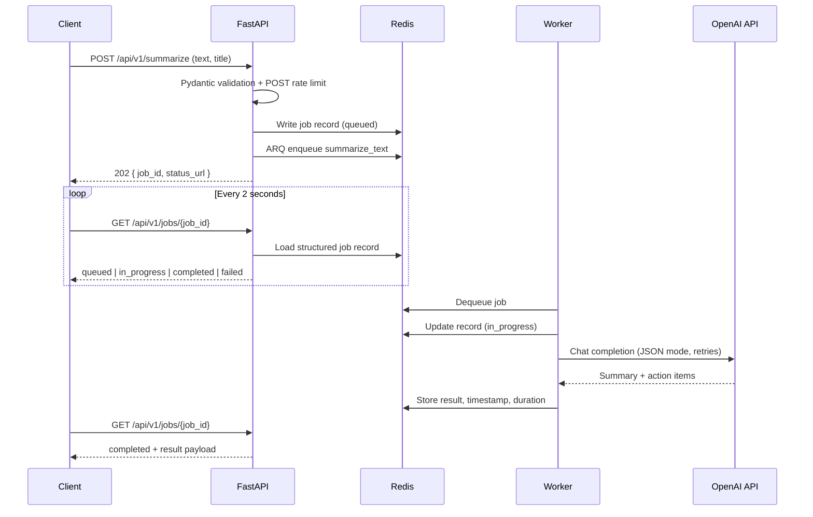

# FastAPI Async AI Worker

Production-style pipeline: FastAPI accepts a summarize job, Redis/ARQ queues it, a worker calls OpenAI (or a mock provider), and the client polls for structured JSON.

## Architecture



Services:

| Service | Role |
| --- | --- |
| `api` | FastAPI app, dashboard, enqueue, status polling |
| `worker` | ARQ process that runs `summarize_text` |
| `redis` | Queue + job-record store + rate-limit counters |

## Local setup

1. Start Redis (Docker is enough):

   ```bash
   docker run -d --name redis -p 6379:6379 redis:7-alpine
   ```

2. Create a virtualenv and install this app plus the sibling rate-limit package:

   ```bash
   python -m venv venv
   venv\Scripts\activate
   pip install -r requirements.txt
   pip install -e ..\fastapi-async-ratelimit
   ```

3. Copy environment variables:

   ```bash
   copy .env.example .env
   ```

   Set `OPENAI_API_KEY` for live model calls. If the key is empty, the worker uses a mock provider so the pipeline still runs.

4. Run the API and worker in two terminals:

   ```bash
   uvicorn app.main:app --reload
   arq app.worker.WorkerSettings
   ```

5. Open [http://127.0.0.1:8000](http://127.0.0.1:8000). Submit text, then watch status poll `/api/v1/jobs/{job_id}` every 2 seconds.

API:

- `POST /api/v1/summarize` — enqueue (rate limited)
- `GET /api/v1/jobs/{job_id}` — `queued` · `in_progress` · `completed` · `failed`
- `GET /health` — liveness
- `GET /docs` — OpenAPI

## Docker

From `fastapi-ai-worker-backend` (expects `../fastapi-async-ratelimit` for the image build):

```bash
copy .env.example .env
docker compose up --build
```

Compose maps `REDIS_HOST=redis` inside the network. The dashboard is at [http://localhost:8000](http://localhost:8000).

## Job record

On each state change the worker writes Redis key `ai_job:{job_id}`:

```json
{
  "job_id": "…",
  "status": "completed",
  "result": {
    "summary": "…",
    "action_items": [{"description": "…", "owner": null, "priority": "high"}],
    "key_topics": ["…"]
  },
  "error": null,
  "timestamp": "2026-08-28T14:00:00+00:00",
  "execution_duration_seconds": 3.21,
  "provider": "openai"
}
```
